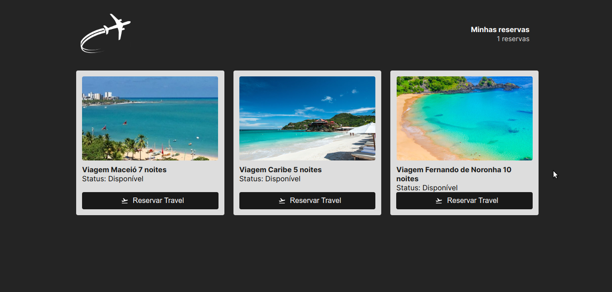

## Descrição do projeto
**Objetivo do Projeto**
- ``Utilizar o redux para passar propriedades entre componentes e utilizar o side-effects do redux-saga para consumir api assícrona``
- ``Refatorar com o redux toolkit,pois a versão 6 do react-router-dom possui bugs quando utilizado com redux antigo``

## 🔨Funcionalidades
  - ``Funcionalidade 1 - Consumir api de reservas de viagem de forma assíncrona com redux-saga``
  - ``Funcionalidade 2 - Passar propriedades entre páginas com redux``
  - ``Funcionalidade 3 - Salvar reservas``
  - ``Funcionalidade 4 - Atualizar a quantidade de reservas por produto``
  - ``Funcionalidade 5 - Deletar reservas``
  
## ✔️ Técnicas e Tecnologias utilizadas
**Criar API Fake em dev**
- ``npm i -g json-server``

**Rodar API Fake no terminal (provisóriamente)**
- ``json-server server.json -p 3333``

**Instalar o Axios**
- ``npm i axios``

**Instalar react icons**
- ``npm i react-icons --save``

**Instalar o Redux e React Redux**
- ``npm i @reduxjs/toolkit react-redux``

**Instalar o immer para lidar com a imutabilidade**
- ``npm i immer``

**Instalar o redux-saga (lidando com side effects)**
- ``npm i redux-saga``

**Instalar o history**
- ``npm i history``

**Instalar o Heroku**
- ``npm install -g heroku``

**Executar servidor**
- ``npm start``

**Executar frontend**
- ``npm run dev``

## 📁 Acesso ao projeto
Acesse os arquivos do projeto [aqui](https://haileicristina.github.io/bookingTravel/)

